# Canvassing

Canvassing is a small GitHub Pages control panel backed by a scheduled GitHub Actions monitor. It watches a focused set of security and education-technology news sources for fresh mentions of:

```txt
ShinyHunters
Canvas
Instructure
```

When a matching article is published on the checked day, the workflow sends one email alert and records the article ID so the same article is not repeated on a later run.

## What It Checks

All requested sources have usable RSS feeds, so the monitor uses feed metadata instead of brittle page scraping.

| Source | Feed | Notes |
| --- | --- | --- |
| Krebs on Security | `https://krebsonsecurity.com/feed/` | WordPress RSS feed with publication dates. |
| BleepingComputer | `https://www.bleepingcomputer.com/feed/` | Official all-stories RSS feed. |
| The Record | `https://therecord.media/feed` | RSS feed from Recorded Future News. |
| EdScoop | `https://edscoop.com/feed/` | WordPress RSS feed. |
| Spiceworks | `https://www.spiceworks.com/feed/` | WordPress RSS feed. |
| Dark Reading | `https://www.darkreading.com/rss.xml` | Public RSS feed. |

## System Flow

```mermaid
flowchart LR
  A["GitHub schedule wakes workflow"] --> B["Node monitor checks RUN_TIME_ET"]
  B --> C["Fetch RSS feeds"]
  C --> D["Filter to today's ET publication date"]
  D --> E["Match ShinyHunters, Canvas, Instructure"]
  E --> F["Skip IDs already seen"]
  F --> G["Send email alert"]
  G --> H["Commit data/state.json and public/status.json"]
  H --> I["GitHub Pages dashboard shows latest status"]
```



## Repository Layout

```txt
public/
  index.html       Settings panel hosted on GitHub Pages
  app.js           Password gate and GitHub variable updater
  styles.css       Dashboard styling
  status.json      Last monitor run summary

scripts/
  check-news.mjs   RSS monitor and email sender

data/
  state.json       Baseline date and sent article IDs

.github/workflows/
  pages.yml        Deploys the static dashboard
  monitor.yml      Runs the daily article check
```

## Scheduling

The workflow uses targeted UTC retries around the configured Eastern Time run. GitHub cron schedules are static UTC expressions, so the workflow includes entries for both EDT and EST. The script then gates the real run to the `RUN_TIME_ET` repository variable in `America/Toronto`.

Default:

```txt
RUN_TIME_ET=14:15
RUN_WINDOW_MINUTES=15
```

You can change that time from the GitHub Pages dashboard after unlocking it with:

```txt
canvas
```

The first run baseline is:

```txt
2026-05-11
```

The monitor will not backfill older articles.

GitHub scheduled workflows are best-effort rather than exact-to-the-minute. With the current settings, the intended run window is 7:55pm through 8:09pm ET, and the script records a daily run key so the same day/time does not run twice.

## Email Setup

Recommended provider: Resend.

1. Create a Resend API key.
2. In GitHub, add repository secret `RESEND_API_KEY`.
3. Add repository variable `ALERT_FROM_EMAIL`, for example `Article Monitor <alerts@yourdomain.com>`.
4. Open the GitHub Pages dashboard.
5. Unlock with password `canvas`.
6. Enter the two recipient emails.
7. Enter a fine-grained GitHub token and save settings.

Resend usually requires a verified sending domain for production sending. Their test sender may only send to the account owner, so verify a sender domain before relying on alerts to both recipients.

SMTP is also supported. Add these GitHub Actions secrets:

```txt
SMTP_HOST
SMTP_PORT
SMTP_SECURE
SMTP_USER
SMTP_PASS
```

Then set:

```txt
ALERT_FROM_EMAIL
ALERT_RECIPIENTS
```

`ALERT_RECIPIENTS` can be comma-separated or newline-separated.

## Dashboard Settings

The Pages UI can write these repository variables through the GitHub API:

```txt
ALERT_RECIPIENTS
ALERT_FROM_EMAIL
RUN_TIME_ET
```

Use a fine-grained GitHub token scoped only to this repository with:

```txt
Actions: read and write
Metadata: read
```

The token is used for the browser request to GitHub and is not stored by the app. The password gate is client-side convenience, not real authentication; email provider credentials belong in GitHub Actions secrets.

## Local Development

```sh
npm install
MONITOR_FORCE=true DRY_RUN=true ALERT_RECIPIENTS=you@example.com npm run check
npm run serve
```

For a real local email test, also set `RESEND_API_KEY` or the SMTP secrets in your shell.

## GitHub Pages

After pushing the repository:

1. Go to Settings -> Pages.
2. Set Source to GitHub Actions.
3. Run `Deploy GitHub Pages` once if it does not start automatically.

The deployed dashboard will read `public/status.json`, so it shows the latest committed monitor result after each scheduled run.
